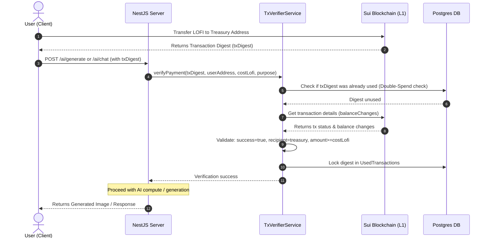
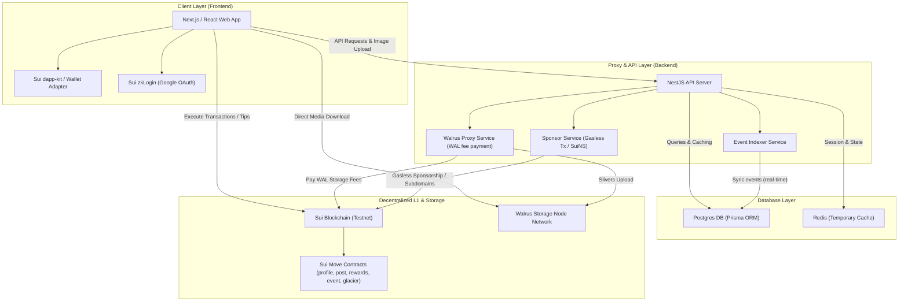
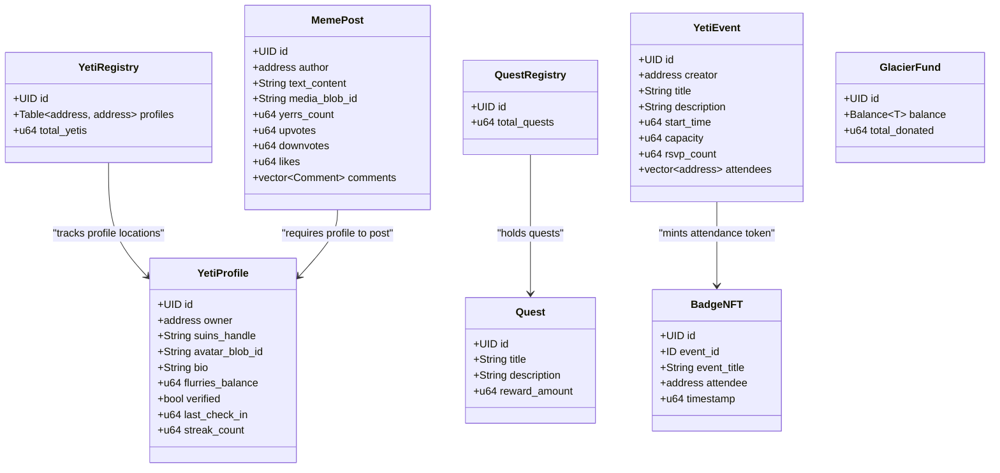
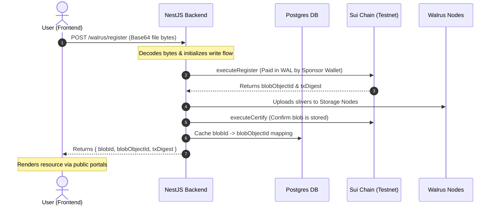

# 🏔️ Yeti Lounge: The Sovereign, Privacy-First Creator Ecosystem

### Short Description
A privacy-first, decentralized social platform custom-built on Sui and inspired by the LOFI meme community. Powered by the Sui and Walrus stack, Yeti Lounge features seamless Web2-style onboarding via zkLogin, gasless operations, on-chain AI image generation, automated token utility loops, and persistent AI agent memory powered by MemWal.

---

## 📖 Project Overview
Web3 constantly preaches censorship resistance and individual sovereignty, yet the entire ecosystem ironically relies on centralized Web2 social media platforms where entire communities and founder accounts are wiped out overnight without warning.

Yeti Lounge completely disrupts this paradox by moving the social graph onto sovereign, immutable rails—without sacrificing the frictionless user experience that modern web users expect.

Built specifically on Sui and inspired by the vibrant LOFI token ecosystem, Yeti Lounge bridges the gap between Web2 convenience and Web3 security. It transforms a passion-driven meme community into a high-utility, functional economic engine where creators actually own their digital footprint, identities, and media assets.

---

## 🛠️ Key Technical Pillars & Features
* **Invisible Web3 Onboarding (Sui zkLogin)**: Users authenticate in seconds using standard Web2 OAuth providers (like Google). No seed phrases, no extension pop-ups, and 100% gasless interactions thanks to Sponsored Transactions.
* **Decentralized Media Layer (Walrus Protocol)**: When a creator publishes a post or media, it bypasses traditional centralized cloud storage. Content is pushed directly to Walrus Protocol as raw, immutable media blobs, ensuring absolute permanence.
* **On-Chain Identity Grid (SuiNS)**: Complex cryptographic wallet addresses are elegantly masked behind human-readable handles via native Sui Name Service resolution, establishing a true, decentralized social graph.
* **AI-Driven Compute Loop (LOFI Token Utility)**: Yeti Lounge hosts a native AI image generation engine. Users spend or lock LOFI tokens as direct payment for AI compute, transforming a community meme asset into a high-velocity utility commodity.
* **Persistent AI Agent Memory (MemWal)**: The platform features a native chat interface powered by an autonomous AI agent. By utilizing MemWal, the agent possesses persistent, decentralized semantic memory, allowing it to securely recall past user contextual interactions entirely on-chain.
* **Seamless Monetization & Wallet Rails**: Includes a streamlined wallet dashboard allowing users to seamlessly deposit native SUI tokens and instantly swap them into LOFI via a one-click internal exchange mechanism, keeping the tipping economy entirely fluid and native.

---

## 💻 Tech Stack
- **Frontend & Hosting**: Next.js / React, hosted on Vercel.
- **Core L1 Architecture**: Sui Network.
- **Identity & UX Primitives**: Sui zkLogin, Sponsored Transactions, SuiNS.
- **Decentralized Storage**: Walrus Protocol.
- **AI Memory Layer**: MemWal.
- **Economic Engine**: LOFI Token Integration.

> [!NOTE]
> This repository was built for the **Lofi The Yeti CLAY Hackathon Round 2**. It delivers a gasless user experience, utilizes decentralized storage, and implements a full on-chain SocialFi ecosystem.

---

## 🤖 AI Features & Token Economics

Yeti Lounge implements an on-chain AI service loop that balances daily free usage with a token utility sink powered by the `$LOFI` token.

### 🎨 Character-Consistent AI Image Generation
- Uses **Google Gemini** (`imagen-3.0-generate-002`) or **OpenAI** (`gpt-image-2` / `gpt-image-1`) to produce custom yeti illustrations.
- Enforces character consistency rules (frog-like sleepy face, blue lips, white fur framing, droopy blue ears, blue hands/feet, flat vector outlines) via prompt conditioning.
- **Decentralized Storage**: Instead of storing generated assets on centralized servers, the backend uploads raw image bytes to **Walrus Protocol**, returning a certified on-chain aggregator link.

### ❄️ Yeti AI Copilot & MemWal Semantic Memory
- A friendly, snowboard-loving assistant powered by **Gemini** (`gemini-2.5-flash`) or **OpenAI** (`gpt-4o`).
- **MemWal Integration**: Connects to decentralized semantic memory on Walrus via the `WalrusMemoryService` to record chat turns, role associations, session histories, and timestamps.
- **Multi-Agent Debates**: Initiates autonomous creative brainstorm debates (e.g. Chill Yeti vs. Alpha Yeti) to output optimal, high-quality mascot ideas.

### 🪙 LOFI Token Payments & Double-Spend Verification
Users receive **1 free daily image generation** and **5 free daily chat sessions**. Exceeding these daily limits requires $LOFI token payments:
- **Image Generation**: `1.0 LOFI`
- **Yeti Copilot Chat**: `0.1 LOFI`
- **Multi-Agent Debate**: `2.0 LOFI`

The backend verifies these payments in real-time on-chain before performing any AI compute.



---

## 🏗️ Architecture Overview

The system consists of three main components:
1. **Sui Move Smart Contracts (`/smc`)**: On-chain data structures and rules for profiles, posts, rewards, events, and charity funds.
2. **NestJS Backend (`/backend`)**: A caching, indexing, and transaction-sponsoring proxy.
3. **Next.js Frontend (`/frontend`)**: A responsive, animated client utilizing Sui `dapp-kit`, zkLogin, and Framer Motion.




---

## 📦 Smart Contract Modules

Located in [smc/contracts/sources](./smc/contracts/sources), the contracts are written in modern **Sui Move 2024** edition syntax.



---

## 🌊 Walrus Media Storage Flow

To prevent users from needing WAL tokens to pay for raw storage fees, Yeti Lounge utilizes a backend-mediated registration flow.



---

## ⚡ Gasless Transaction Sponsorship

The NestJS backend acts as a **Sponsor Guardian** to allow users to interact gaslessly with the blockchain.

- **Local Sponsorship**: For specific transactions, the backend reconstructs the transaction from kind bytes, appends the sponsor's gas coins, builds, and signs it.
- **Enoki Integration**: Connects with Mysten Labs' Enoki service to delegate sponsored execution on-chain.
- **Sponsored Walrus Storage**: Storage node payments and registration fees are fully sponsored and handled on-chain by the backend's funded wallet.


---

## 🚀 Setup & Installation

### Prerequisites
- Node.js (v18+)
- Sui CLI (installed and configured for `testnet`)
- Postgres Database (running locally or in Docker)

### 1. Smart Contracts
```bash
cd smc/contracts
sui move build
```

### 2. Backend Setup
1. Navigate to `/backend` and create a `.env` file from the placeholder values.
2. Initialize and start the backend:
```bash
cd backend
npm install
npx prisma db push
npm run start:dev
```

### 3. Frontend Setup
1. Navigate to `/frontend` and configure environment variables inside `.env.local`.
2. Launch the client:
```bash
cd frontend
npm install
npm run dev
```
Open [http://localhost:3000](http://localhost:3000) to view the application.
