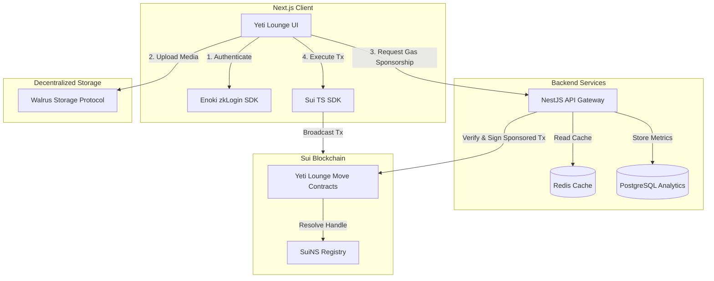
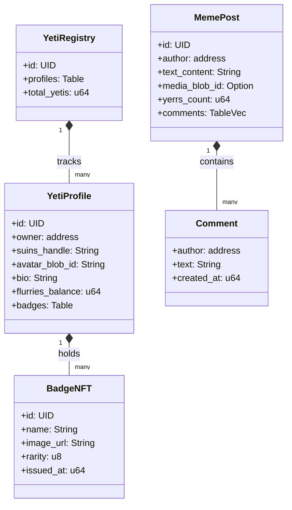
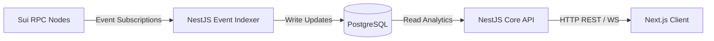
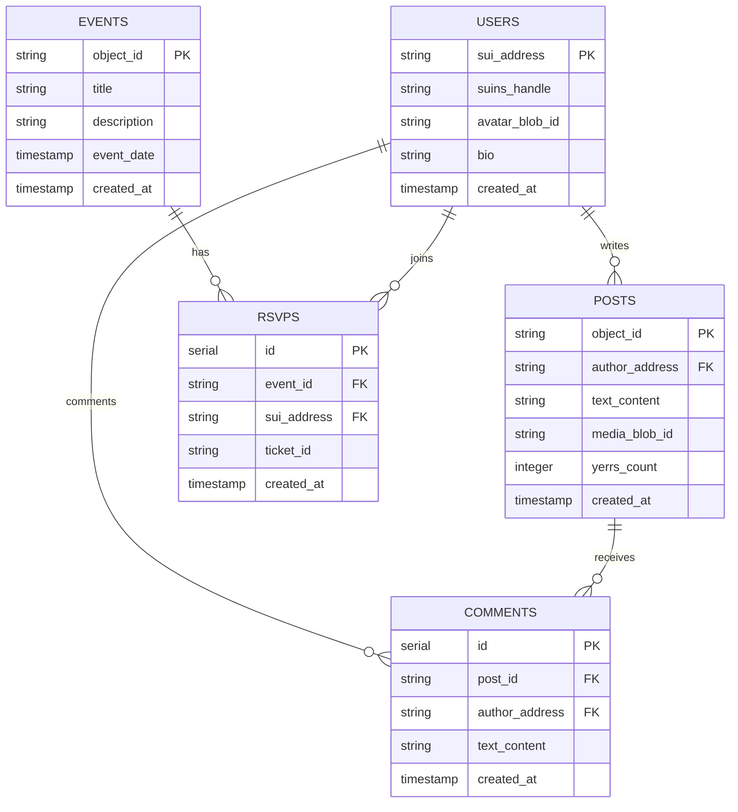
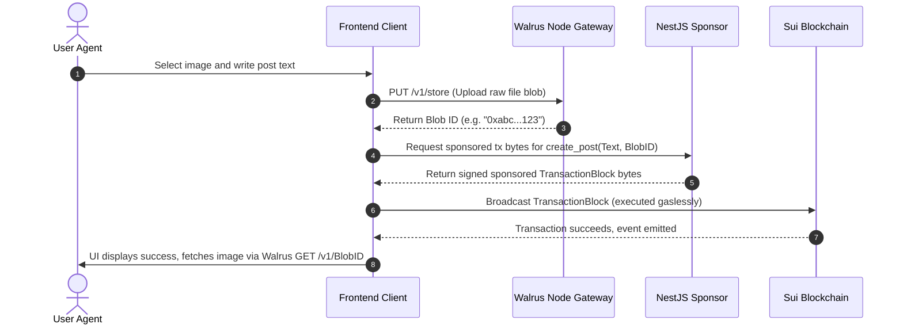

# Yeti Lounge 🥶 — Backend & Smart Contract Architecture

This document plans the smart contracts (Sui Move) and backend architecture (NestJS + Walrus) required to make the Yeti Lounge SocialFi platform fully functional and ready for production.

---

## 1. System Architecture Overview

The Yeti Lounge tech stack leverages Sui’s object-centric model, Walrus for decentralized media storage, Enoki for gasless zkLogin Google auth, and a NestJS backend for transaction sponsorship, caching, and analytics indexers.

---

## 2. Sui Move Smart Contracts

Sui’s object model allows us to model users, posts, events, and badges as distinct, ownable on-chain objects.

### Move Modules Overview

We will structure the smart contract repository as a single package `yeti_lounge` containing these modules:

1. `profile.move`: Core user identity mapping handles, metadata, and badges.
2. `post.move`: On-chain social interactions, reactions, and reference pointers to Walrus storage blobs.
3. `event.move`: Decoupled ticketing, AMAs, virtual RSVP registrations, and attendance badges.
4. `rewards.move`: Governance rules for minting badge rewards, token drips, and daily login checklists.

### Move Object Models Hierarchy

### Module Interface & Function Designs

#### `profile.move`
- `create_profile(registry: &mut YetiRegistry, suins_handle: String, avatar_blob_id: String, bio: String, ctx: &mut TxContext)`:
  - Mints a `YetiProfile` object and transfers it to the sender.
  - Registers the mapping in `YetiRegistry`.
- `update_avatar(profile: &mut YetiProfile, new_blob_id: String)`: Updates profile media.
- `add_badge(profile: &mut YetiProfile, badge: BadgeNFT)`: Attaches a new badge as a dynamic field.

#### `post.move`
- `create_post(profile: &YetiProfile, text_content: String, media_blob_id: Option<String>, ctx: &mut TxContext)`:
  - Mints a shared `MemePost` object.
  - Increments post counter statistics.
- `yerr_post(post: &mut MemePost)`: Increments the reaction counter (`yerrs_count`).
- `add_comment(post: &mut MemePost, text: String, ctx: &mut TxContext)`: Appends a comment to the post.

#### `event.move`
- `create_event(title: String, description: String, gated_token: Option<address>, ctx: &mut TxContext)`: Creates a shared `YetiEvent` scheduler object.
- `rsvp_event(event: &mut YetiEvent, profile: &YetiProfile, ctx: &mut TxContext)`:
  - Validates requirements (e.g. NFT gating).
  - Emits an RSVP Event log and issues an attendance ticket.

---

## 3. Web2 Backend & Indexing Services (NestJS)

To keep the application highly responsive, the NestJS backend acts as a read-cache provider, event indexer, and transaction sponsor.

### Key Modules inside NestJS Backend

1. **Sponsorship Module (Sponsor Guardian)**:
   - Exposes a `/sponsored/execute` endpoint.
   - Receives transaction bytes from the client, validates that the transaction is safe and conforms to the permitted rules (e.g., limit to `create_profile` or `create_post` calls), signs with the developer's gas wallet key, and broadcasts it.
2. **Media Gateway Module (Walrus Client)**:
   - Interacts with Walrus store endpoints to facilitate clean uploads and downloads from the frontend.
3. **Indexer Module**:
   - Subscribes to events emitted by the Move contracts (e.g., `ProfileCreated`, `PostCreated`, `EventRSVP`).
   - Populates database tables to feed leaderboards and flurry metrics graphs.

### 3.1 PostgreSQL Database Schema (Indexer & Cache Layer)

PostgreSQL acts as our lightning-fast cache and indexing layer. Because querying the Sui blockchain directly via RPC for feeds, search, and leaderboards is slow and resource-intensive, the Indexer module mirrors the on-chain object state into these relational database tables:

#### Rationale for PostgreSQL:
- **Feeds & Pagination**: Loading the main meme feed with pagination (Cursor or Offset) is trivial in SQL but complex and slow when querying raw Sui object vectors.
- **Aggregations**: Calculating leaderboard rankings (e.g., "Top Meme Creators" based on `yerrs_count` or "Top Donors") requires standard SQL `SUM` and `GROUP BY` aggregations.
- **Relational Integrity**: Tracks who commented on which post and who RSVP'd to events, combining Web3 public keys with resolved metadata.

---

## 4. Walrus Media Integration Flow

Yeti Lounge stores user avatars and meme assets on **Walrus** (a decentralized storage network designed by Mysten Labs) instead of on-chain gas-heavy storage or centralized servers.

---

## 5. Security & Gas Sponsorship Best Practices

1. **Gas Pool Safety**: The NestJS Sponsor module must validate that transaction blocks contain only allowed move call entries to prevent malicious users from draining the gas budget on arbitrary transactions.
2. **Access Control**: Core administrative functions in the Move contracts (such as updating reward drip configurations) are guarded by a `Cap` object (e.g., `AdminCap`) given to the publisher.
3. **zkLogin Auditing**: When signing transactions on behalf of users, the Enoki SDK enforces OIDC verification so that only the valid Google user can perform writes to their own `YetiProfile`.

---

## 6. Advanced Production Considerations

To make the architecture 100% complete and resilient for launch, we incorporate the following systems:

### 6.1 Sybil Protection & Sponsor Rate-Limiting
Sponsoring transactions is free for the user, but costs gas tokens for the developers. To protect the developer's gas pool:
- **Rate-Limiter Cache**: The NestJS gateway tracks the active user address (derived from zkLogin JWT) in Redis.
- **Quota Limit**: Limit users to a maximum of 5 sponsored transactions per day.
- **Whitelist Enforcement**: Only sponsor transactions calling specific package ID entry functions (e.g., `yeti_lounge::profile::create_profile` or `yeti_lounge::post::create_post`).

### 6.2 Real-Time Updates via WebSockets (Socket.io)
Social feeds and rewards require live visual feedback:
- **NestJS Gateway**: Exposes a WebSocket namespace `/events` using Socket.io.
- **Flow**: Whenever the indexer database detects a new `MemePost` or reaction event (`yerr_post`), the backend automatically broadcasts a lightweight payload to all connected clients on that channel, updating the feed in real time without manual page refreshes.

### 6.3 Walrus Storage Epoch Management & Renewals
By default, files stored on Walrus are assigned a lease duration (measured in epochs):
- **Storage Strategy**: During upload, we buy storage space on Walrus using a storage voucher (SUI tokens).
- **Auto-Renewal**: The NestJS backend schedules a cron job that checks the expiration epoch of active blobs. If the lease is nearing expiry, it calls the Walrus storage contract on Sui to renew the storage lease for popular posts.

### 6.4 SuiNS Handle Resolution
For decentralized profiles, registering and resolving usernames like `bard.yeti` is essential:
- **Contract Level**: The profile creation function references the Sui Name Service (SuiNS) registry object to verify handle ownership and bind the resolved address to the profile.
- **Backend Resolvers**: The NestJS API integrates the `@mysten/suins` resolver SDK to map addresses to handles for faster lookup during indexing.
