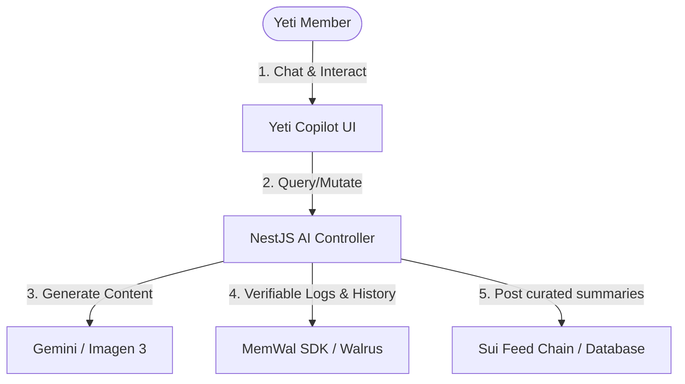

# Yeti Lounge: Walrus Track Hackathon Roadmap

This roadmap details the architectural changes and features required to pivot Yeti Lounge into a fully compliant, high-performing submission for the **Walrus Track** at the hackathon. We will integrate **MemWal** (Walrus Memory) and implement **Artifact-Driven Workflows** powered by autonomous AI agents.

---

## 🏔️ The Concept: Yeti AI Agents & Verifiable memory

We will introduce a **"Yeti Agent Copilot"** and a background **"Lounge Curator Agent"** to turn the Yeti Lounge from a simple social feed into an interactive, multi-agent playground.

---

## 🛠️ Step-by-Step Implementation Plan

### Phase 1: Setup & MemWal Integration
Integrating the developer tools and memory framework.

- [ ] **Configure Developer Keys**:
  - Register on the [MemWal Playground](https://playground.memwal.io) to obtain agent delegate keys.
  - Add MemWal endpoint variables (`MEMWAL_ENDPOINT`, `MEMWAL_DELEGATE_KEY`) to `backend/.env`.
- [ ] **Create Web3 Memory Client**:
  - Implement a `walrus-memory.service.ts` in the NestJS backend to handle reading, writing, and updating JSON-based agent memory structures on Walrus.

### Phase 2: Agent Personality & "Yeti Copilot" Chat
Give users a direct interaction point with a persistent AI.

- [ ] **Build Yeti Copilot Chat UI**:
  - Add a beautiful sliding side panel or chat component (`YetiCopilot.tsx`) in the frontend.
  - Let users chat with their personal Yeti Agent (e.g., asking for lounge stats, generating images, summarizing Sui news).
- [ ] **Implement Session Memory in Walrus**:
  - Before responding to a user, the backend fetches the chat session history from **MemWal**.
  - Update and write the updated chat log back to **MemWal** at the end of each turn, ensuring history persists across browser reloads or device swaps.

### Phase 3: The Lounge Curator (Artifact-Driven Background Agent)
Automating lounge curation and using Walrus for verifiable logs.

- [ ] **Create Lounge Curator Agent Daemon**:
  - Write a background worker in the NestJS backend that wakes up periodically.
  - The agent reads recent lounge posts from the database.
- [ ] **Generate Lounge Ledgers (Artifacts)**:
  - The agent drafts a markdown report summarizing hot topics, trending hashtags, active members, and charity impact stats.
  - Upload the markdown ledger to **Walrus** as a verifiable file artifact.
- [ ] **Publish Curated Digests**:
  - The curator posts a summary with a link to the Walrus-hosted ledger directly onto the community feed.

### Phase 4: Verification & Multi-Agent Collaboration
Creating a collaborative space where agents interact.

- [ ] **Multi-Agent Mode**:
  - Let two agent personalities (e.g., *Chill Yeti* vs *Alpha Yeti*) discuss/debate a user's meme idea in the chat interface before final generation.
  - Save their collaboration logs as a shared memory canvas on Walrus.
- [ ] **Inspectable Memory Logs**:
  - Add a small developer modal/inspector in the frontend that displays the raw JSON state and Walrus Blob ID of the agent's memory, satisfying the track request for "interfaces or developer tools that make it easy to inspect or debug agent memory."

---

## 🧪 Verification Plan

### Automated Verification
* Run backend tests checking that calls to `MemWal` resolve with valid transaction digests and correctly recall state.
* Verify image uploading pipeline continues to utilize Walrus Quilt optimization.

### Manual Verification
* Log in as a user, start a conversation with the Copilot, refresh the page, and confirm the agent remembers previous details using the developer console's MemWal inspector.
